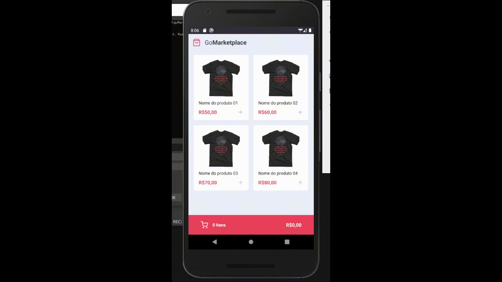

# GoMarketplace 🛍️

This repository is for the Rocketseat Bootcamp GoStack 11.0 'React Native Fundamentals' challenge 🚀.

# Proposal

This project is a study of the Context concepts of React-Native, having the Context API and its hook (useContext) as its 'flagship'.
The idea is to simulate a fictitious store, bringing data from a Fake API and integrating the information available on screen, such as quantity of products and final price.
The difference is the Dark Theme, which was also built using React's Context API.

# Technologies Used

React ⚛️  
React Native ⚛️  
React Navigation ⚛️  
Styled-Components 💅🏻  
Typescript ⌨️

# Use

To obtain this project, follow the steps:

1. Clone this repository using<code>git clone</code>.

2. Run the <code> yarn </code> command at the root of the cloned project folder to download the dependencies.
3. Run the command <code> yarn android </code> (if emulating on an android) or <code> yarn ios </code> (if emulating on an ios) at the root of the cloned project folder to install the app on the emulator.
4. Run <code> yarn json-server server.json -p 3333 </code> at the root of the project folder to initialize the Fake API.
5. Run <code> yarn start </code> at the root of the project folder to start Metro Bundler.
6. Open the project in your emulator.
7. Happy Hacking! 🚀

⚠️ If the project does not show the products, run <code> adb reverse tcp: 3333 tcp: 3333 </code> before starting the Fake API ⚠️

